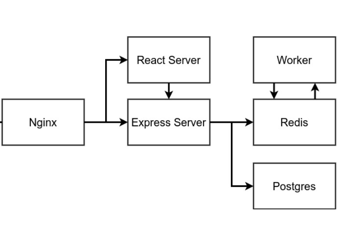

# zadanie1

Opracowana usluga sklada sie z 6 mikrouslug:

    Aplikacji React- odpowiedzialnej za przyjmowanie rzadan od uzytkownika oraz prezentacji ich wynikow z bazy Postgresql oraz Redis
    Servera Express - udostepniajacego wartosci wspolczynnikow z bazy danych Postgresql
    Bazy danych postgresql przechowujacej wartosci wspolczynnikow wyslanych przez uzytkownika
    Serwera Redis przechowujacego wartosci wyliczone na podstawie wspolczynnikow podanych przez uzytkownika
    Workera, ktory sledzi wprowadzenie nowej wartosci wspolczynnika ciagu, oblicza dla niej wartosc oraz przekazuje do bazy Redis
    Serwera Nginx, ktory pozwala na odpowiednie przekierowanie zapytania w zaleznosci czy odwoluje sie do postgresql czy redis

W niniejszej usludze zmieniono wersje obrazow bazowych dockerfileow z latest na inne w celu zachowania stabilnoci uslugi, w przeciwnym wypadku przy kazdym uruchomieniu uslugi zostalyby uzyte wersje obrazow bazowych aktualne w momencie uruchomienia, a wiec nie zawsze te same, co mogloby spowodowac bledy nieprzewidziane a takze trudne do wykrycia ze wzgledu na brak jawnej informacji o stosowanej wersji obrazow:

    node:14.14.0-alpine
    redis:6.2
    postgres:14.0

Dodatkowo w mikrousludze clienta ustawiono aktualizacje obliczonych wartosci ciagu fibonacciego przy kazdym rzadaniu wysylanym do bazy danych
